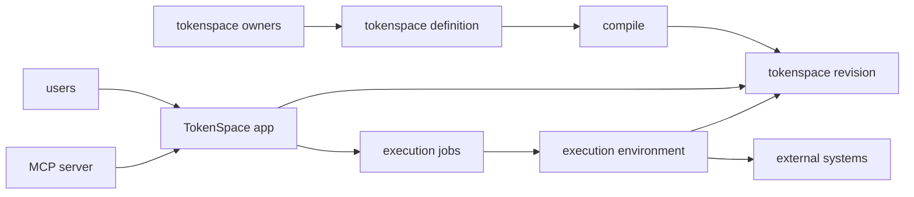

Core components:
- tokenspace definition
- TokenSpace app
- Execution environment

A tokenspace definition is the collection of code, markdown files and other supporting content that defines what the AI can do and the guardrails that regulate its behavior. The tokenspace definition is typically stored in a Git repository and is edited by tokenspace owners. A tokenspace definition is then compiled into a tokenspace environment that can be used by the AI.

Code in a tokenspace defines specific APIs, called capabilities, that specify how the AI can act on a specific external system. Capabilities expose actions, which are basically functions, which can then be called by agent-generated code. Capability code in the tokenspace is privileged (we also refer to it as "privileged code" sometimes) and can access system APIs, networking, the real filesystem and can obtain credentials/secrets. Agent-generated code on the other hand is sandboxed (we also refer to it as "sandboxed code" sometimes) and can only access the capabilities defined in the tokenspace and nothing else (no system APIs, no networking, only the virtual session filesystem, not the real filesystem).

The TokenSpace app manages the environments that are created based on the tokenspace definition. Multiple revisions of the same tokenspace can be used at the same time. There is one default revision (the main branch) per tokenspace, but a user can switch to a different revision or branch in the UI to test changes to the tokenspace before making it active for the entire team.

A tokenspace can also be accessed via an MCP server. This allows users to use other clients, such as Claude Desktop, VSCode, etc. to interact with the tokenspace directly.

The execution environment (aka executor) is responsible for executing the agent-generated code in a sandboxed environment. When agent-generated code is executed, a new job is sent to the execution environment. The execution environment then executes the code in a sandboxed environment, store the result in the job and notifies the TokenSpace app that the job is completed. The execution environment is separate from the TokenSpace app and is designed to be self-hostable and deployed in the target environment the AI is meant to operate in. 
